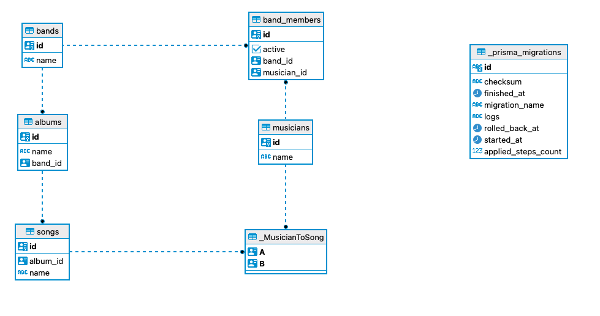

# Discography

Sample application for learning [Redwood.js](https://redwoodjs.com/) and [Prisma.js](https://www.prisma.io/)

## Get started
```
# install dependencies
yarn install
# set up config
cp .env.example .env
# start up database servers
docker-compose up -d
# rebuild database, migrations and seed
yarn rw prisma migrate reset --force
# development console
yarn rw console
# development server
yarn rw dev
```

## Sample application

A naive implementation for managing Bands and their Discographies.

We are ignoring compilation albums (more than one band) for simplicity.

### Data model

Our sample application is running a postgres database inside a Docker container.

#### The database schema:



## Learning

I recommend reading the links listed in the Resources section of each document:

- Data modeling and querying with Prisma
  - [Intro](./docs/prisma-1-intro.md)
  - [one-to-many](./docs/prisma-2-one-to-many.md)
- TODO: services
- TODO: GraphQL
- TODO: front end

## WIP...

```
yarn rw console

const gojira1 = await db.band.findFirst({ where: { name: 'Gojira' }})
const gojira2 = await db.band.findFirst({ where: { name: 'Gojira' }, include: { albums: true }})
const gojira3 = await db.band.findFirst({ where: { name: 'Gojira' }, include: { albums: { include: { songs: true }} }})
const gojira = await db.band.findUnique({ where: { id: gojira1.id }})

const bands = await db.band.findMany({ include: { albums: { include: { songs: true }}}});
bands.forEach((band) => {
  console.log(`======== ${band.name}`);
  band.albums.forEach((album) => {
    console.log(`  ${album.name}`);
    album.songs.forEach((song) => {
      console.log(`  - ${song.name}`);
    })
  })
});


const bands = await db.band.findMany({ include: { members: { include: { musician: true } } } });
bands.forEach((band) => {
  console.log(`======== ${band.name}`);
  band.members.forEach((member) => {
    console.log(`  ${member.musician.name}`);
  })
})
```

```
/Applications/Postgres.app/Contents/Versions/14/bin/psql $DATABASE_URL
```

## Resources

- https://redwoodjs.com
- https://www.prisma.io/docs/concepts/components/prisma-schema/data-model

## Notes

```
yarn rw prisma migrate dev --name xxxx
yarn redwood prisma db seed
```
## TODO: Copy seed code to example README files for each variation

- different relations types
- lower case table names
- uuid PK postgres, extension migration
- transactions with sql logging


- implicit many-to-many
  - table naming: _Table1ToTable2 i.e. _BandToMusician
    - with A and B as column names for the foreign keys
  - https://stackoverflow.com/a/71677210/317989
  - my preference: Avoid and use explicit many-to-many

---

## TODO:
- `docs/prisma-1-intro.md`
  - check out difference between `pgcrypto` and `uuid-ossp`, which should we prefer in these docs?
  - research what the `handlePrismaLogging` is doing


